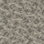

# Tas d'ossements et nasse à poissons — 0.27.12

## Tas d'ossements `ballista:bone_pile`

Le tas d'ossements n'est **pas** un cube plein retexturé : son modèle réel `assets/ballista/models/block/bone_pile.json` comporte **82 éléments cubiques en relief**, utilisant la texture d'os carbonisé du mod et une texture de squelette de Minecraft. Il est utilisé par la logique d'aménagement des tanières dans `LairRules`/`DragonLairLayout`.

- **Apparence :** relief 3D irrégulier (82 éléments) ; le modèle est tourné aléatoirement à 0°, 90°, 180° ou 270° selon `blockstates/bone_pile.json`.
- **Interaction :** le bloc a une forme de sélection allant environ de `y = 0` à `11,2/16` et une **collision vide**, selon `BonePileBlock.class` ; il est donc traversable.
- **Son :** lorsqu'une entité vivante se déplace dedans, le code peut jouer `SKELETON_STEP` avec un délai de protection contre la répétition.
- **Destruction :** sa table de butin déclare **7 os** dans les conditions normales. Résistance déclarée : `0,7` ; son de bloc `BONE_BLOCK`.
- **Fabrication :** aucun JSON de recette directe `bone_pile.json` n'est fourni dans ce JAR. Ne pas inventer de recette de table de craft.



*Cette image est uniquement la texture de matière présente dans le JAR, et **pas** une capture du modèle complet.* [Voir le modèle 3D réel au format JSON](site/assets/02712/models/bone_pile.json).

## Nasse à poissons `ballista:fish_trap`

La nasse est un **bloc orientable et rempli d'eau**, avec un inventaire de **5 emplacements** : 1 pour l'appât et 4 pour les poissons.

**Recette vérifiée :**

```text
B S B
S . S
P P P
```

`B` = bâton ; `S` = ficelle ; `P` = n'importe quelle planche acceptée par `#minecraft:planks` ; `.` = case vide.

**Utilisation :**

1. Fabriquer la nasse, la placer **dans l'eau**, face à une case d'eau libre (l'emplacement doit être waterlogged, avec de l'eau dans la direction où elle est orientée).
2. Ouvrir son interface et déposer des **graines de blé** dans le premier emplacement. Les quatre autres sont réservés aux captures.
3. Lorsque le bloc est chargé en jeu, la logique vérifie les conditions environ toutes les 20 ticks ; une prise réussie arrive après un compte à rebours prévu de **120 à 240 secondes** (à 20 ticks/s), pour **une graine consommée par prise**.
4. Le rendu du bloc peut afficher la capture : cabillaud, saumon, poisson tropical ou poisson-globe. Il utilise des modèles distincts selon le contenu.

**Répartition prévue par `FishTrapRules.fish` :**

| Milieu déterminé par le code | Poissons possibles |
|---|---|
| Rivière ou rivière gelée | Saumon |
| Océan chaud ou tiède | 80 % poisson tropical, 20 % poisson-globe |
| Autres biomes | Cabillaud et saumon ; distribution dépendant de la condition « autre mer » du code |

> Les taux ci-dessus résultent du bytecode et de l'aléatoire interne ; l'inventaire plein ou l'absence d'eau/graine empêchent la production. Les probabilités et les biomes doivent encore être validés dans Minecraft. Les inventaires de nasse sont enregistrés dans les données du bloc.

[Source recette](RECETTES_VERSION_0_27_12.md) · [Guide 0.27.12](GUIDE_VERSION_0_27_12.md) · [Audit](ANALYSE_JAR_0_27_12.md).
