# Dragons et bastions — Wiki officiel

## 🆕 Dernier JAR analysé : 0.27.12-candidate

**[Consulter le guide complet 0.27.12](GUIDE_VERSION_0_27_12.md)** · **[32 recettes vérifiées](RECETTES_VERSION_0_27_12.md)** · **[Tas d'ossements et nasse à poissons](BLOCS_ET_MECANIQUES_0_27_12.md)** · **[Savoir I–III](ENCHANTEMENT_SAVOIR_0_27_12.md)** · **[Structures et butins](STRUCTURES_BUTIN_0_27_12.md)** · **[Index des contenus](INDEX_CONTENU_0_27_12.md)** · **[Audit technique](ANALYSE_JAR_0_27_12.md)** · **[English overview](GUIDE_VERSION_0_27_12_EN.md)**

Le JAR **`ballista-fabric-0.27.12-candidate+mc26.1-26.3-test.jar`** contient cinq modules destinés à **Minecraft 26.1, 26.1.1, 26.1.2, 26.2 et 26.3** selon leurs métadonnées Fabric. Il ne permet pas de conclure sur les autres versions historiques de Minecraft, dont 1.21.x. **Version de test non validée en jeu**.

Cette version présente **4 dragons (dont le noir monté par un chasseur illageois), 5 fioles de mauvais présage draconique, 3 balistes, 32 recettes, un tas d'ossements 3D à 82 pièces, une nasse à poissons, Savoir I–III, des tanières, camps et événements nocturnes**. Les pages détaillées distinguent les faits tirés des fichiers et les contrôles qui restent à effectuer en partie.

[🌐 Voir aussi la page HTML 0.27.12](site/maj-0-27-12.html) · [Fabrications 0.27.12](site/recettes-0-27-12.html) · [Nouveaux blocs](site/blocs-0-27-12.html)

---

### Archives : 0.27.1 et 0.27.10

**Construire ses défenses, découvrir les antres, élever un dragon et améliorer son équipement.** Ce guide rassemble les explications de la version 0.27.10 et les **29 recettes historiques illustrées directement dans le README**, avec les ingrédients à gauche et le résultat à droite.

**Documentation historique : 0.27.1 pour Minecraft Java 26.2, avec Fabric.** L'archive précédente, **0.27.10-candidate pour Minecraft Java 26.1 à 26.3**, est documentée séparément dans **[le guide des nouveautés 0.27.10](GUIDE_VERSION_0_27_10.md)**. Les chiffres et recettes ci-dessous concernent la version historique sauf indication contraire. Le mod porte encore le nom « Baliste » dans sa fiche de chargement. Les règles décrites sont celles du JAR fourni par l'auteur, sans datapack modifiant ses recettes. Les durées supposent un serveur à 20 ticks par seconde : 20 ticks = 1 seconde.

> Les recettes et les mécanismes ont été vérifiés dans les ressources et le code du mod. Les illustrations utilisent les textures et les modèles réels, rendus hors du jeu ; elles ne sont pas des captures de Minecraft. Cette vérification ne constitue pas un test en jeu de toutes les interactions.

**Nouveautés 0.27.10 :** dragon noir, cœur noir, cœur gelé, ponte familiale, tanières aménagées, camps illageois et raids draconiques I à V. Consultez [le guide actualisé](GUIDE_VERSION_0_27_10.md) pour les mécanismes et conditions tirés du bytecode de la nouvelle version.

## Nouveautés : version **0.27.10-candidate** (Minecraft Java 26.1 à 26.3)

La nouvelle version contient quatre dragons (rouge, vert, bleu et **noir**), la ponte et le suivi familial, des tanières à aménager, des camps de pillards avec chasseurs illageois, **cinq niveaux de raids draconiques** et deux nouvelles recettes de forge. **Les 29 recettes illustrées ci-dessous restent celles du JAR historique 0.27.1 ; le JAR 0.27.10 contient 31 recettes.**

### Dragon noir : un adversaire accompagné d'un chasseur monté

 

Le **dragon noir corrompu** (`ballista:black_dragon`) est la **quatrième couleur** de dragon. Il est allié aux **illageois et autres dragons noirs**. Il possède son œuf incubable, son œuf d'apparition et son cœur noir spécifique. Les attributs de base du dragon sont **24 PV et 3 dégâts** nouveau-né, **60 PV et 7 dégâts** adolescent, **120 PV et 12 dégâts** adulte.

**Pendant le renfort draconique de fin de raid des niveaux III, IV et V**, le jeu prévoit un **chasseur de dragons illageois monté sur le premier dragon noir adulte**. Le code ne se contente pas de faire apparaître deux entités proches : il équipe le dragon d'une selle et appelle `startRiding` pour installer le chasseur dessus.

Le **chasseur illageois** (`ballista:illager_dragon_hunter`) a **60 PV**, une **armure complète en diamant** et un **bâton draconique**. Il tire des **boules de feu** sur une cible visible entre environ **3 et 24 blocs**, avec **60 ticks** entre les tirs valides. Le dragon conserve sa propre IA ; pendant le raid, sa cible est transmise au cavalier. Le code de butin du chasseur prévoit **un cœur noir**, et parfois une à deux cartes de tanières illageoises si les structures appropriées sont trouvées.

[**Lire le guide détaillé du dragon noir et de son cavalier**](DRAGON_NOIR_ET_RAIDS.md#1-le-dragon-noir--un-quatrième-dragon-allié-des-illageois) · [**Voir la page illustrée du dragon noir**](site/dragon-noir.html).

### Les cinq fioles de mauvais présage draconique : effets et dragons

Les fioles **`ballista:draconic_omen_1` à `ballista:draconic_omen_5`** se **boivent** pendant **32 ticks** (environ 1,6 s). Elles remplacent l'ancien Mauvais présage et appliquent **Mauvais présage I à V** pendant **120 000 ticks (100 minutes)**. Une bouteille vide est rendue. Il ne s'agit pas de cinq effets élémentaires distincts : c'est la **puissance du présage** et la composition du raid qui changent.

**IMPORTANT : les dragons arrivent en renfort à la DERNIÈRE vague du raid**, et non à chaque vague. Leur apparition dépend des emplacements disponibles.

| Fiole (textures réelles du mod) | Renfort draconique final | Chasseur illageois monté | Récompense maximale |
|---|---|---|---|
|  **I** | 1 dragon noir **adolescent** | Non | Héros légendaire I |
|  **II** | 1 dragon noir **adolescent** | Non | Héros légendaire II |
|  **III** | 1 dragon noir **adulte** | **Oui** | Héros légendaire III |
|  **IV** | 3 dragons noirs **adultes** | **Oui, sur le premier uniquement** | Héros légendaire IV |
|  **V** | 3 dragons noirs **adultes** | **Oui, sur le premier uniquement** | Héros légendaire V |

Après la victoire du raid et la mort de **tous les dragons du renfort**, le mod attribue les **avancements Héros légendaire** jusqu'au meilleur rang atteint et conserve un bonus **Héros du village** de niveau correspondant, appliqué avec une **durée infinie** et restauré depuis les données du joueur.

Les cinq fioles existent dans le registre du mod et ont leurs textures propres, mais **aucune recette de craft** n'a été identifiée pour elles parmi les 31 recettes du JAR. La différence entre les niveaux IV et V ne réside **pas** dans un quatrième dragon : elle concerne surtout le rang du raid et sa récompense.

[**Guide complet des fioles, des effets et des récompenses**](DRAGON_NOIR_ET_RAIDS.md#3-les-cinq-fioles-de-mauvais-présage-draconique) · [**Page illustrée des cinq fioles**](site/raids-draconiques.html).

| Objet ajouté | Texture tirée du JAR | Mécanisme principal |
|---|---|---|
| Cœur de dragon gelé |  | Forge d'armures : premier palier 4 niveaux ; second 12 niveaux avec historique diamant → netherite |
| Cœur de dragon noir |  | Forge : épée, hache, pioche, pelle, houe ou pièce d'armure en diamant/netherite ; stades I et II |
| Œuf noir |  | Quatrième dragon et œuf incubable ; modèle différent de son œuf d'apparition |
| Présage draconique V |  | Raids draconiques de niveaux I à V et défis Héros légendaire |

**Cœurs :** la pioche portant un cœur noir peut activer/désactiver la fonte automatique par interaction accroupie. L'armure noire accorde 5 % de réduction supplémentaire par stade équipé dans la fonction du mod (maximum théorique 40 %) ; le vol de vie des armes est de 10 % au stade I et 20 % au stade II des dégâts effectivement perdus par la cible.

**Ponte :** incubation 48 000 ticks (40 min), ponte d'un adulte sauvage toutes les 36 000 ticks (30 min de simulation) et ponte d'un adulte domestiqué toutes les 144 000 ticks (2 h), sous réserve des conditions de position, de propriété, d'ordre et de zone libre. Le jeune doit également passer les deux étapes de croissance nourries.

**Exploration :** structures d'antres montagneux, grandes cavernes et tanières de pillards, génération dépendant du monde. Les raids draconiques ajoutent des présages I–V et les défis Héros légendaire I–V. Le nouvel ordre « Aménager une tanière » permet au dragon domestiqué de préparer un site valide.

**Documentation actualisée :** [site avec nouveaux chapitres, images et tables](https://ldjo86.github.io/Dragons-et-bastions/#nouveautes) · [guide technique détaillé de la 0.27.10](GUIDE_VERSION_0_27_10.md) · [page de nouveautés](site/maj-0-27-10.html).

**Niveau de validation :** contenu des JAR et code compilé inspectés ; le fonctionnement client/serveur en jeu n'a pas encore été testé.

---

## Sommaire

[Commencer](#commencer) · [Balistes](#balistes) · [Tables d'archerie](#tables) · [Pieux](#pieux) · [Réparations](#reparations) · [Chasseur et commerce](#chasseur) · [Œufs et élevage](#elevage) · [Équipement du dragon](#equipement) · [Ordres et vol](#commandes) · [Armure en écailles](#ecailles) · [Cœur de dragon](#coeur) · [Antres et villages](#monde) · [Menaces nocturnes](#nuit) · [Réglages du monde](#reglages) · [Installation](#installation)

## 1. Commencer une partie

Pour protéger une première base, fabrique une **baliste légère**, installe-la sur un support stable et charge-la avec des flèches ou des amorces. Une **table d'archerie placée directement contre elle ou sous son emprise** permet ensuite de tirer sans consommer de munitions. Les pieux complètent la défense au sol, mais il faut laisser un passage sûr aux joueurs et aux habitants.

Pour obtenir une monture, récupère un **œuf de dragon à incuber**, prépare une installation chauffée au magma ou à la lave, puis reste présent à l'éclosion. Le bébé doit ensuite être nourri pendant deux étapes de croissance. La selle et l'armure ne deviennent utilisables sur lui qu'à l'âge adulte.

Les **écailles** servent aux équipements et aux renforts d'armure. Les **cœurs de dragon** servent à améliorer des armes, des outils, des boucliers et certains livres enchantés. Le chasseur de dragons permet aussi d'acheter ou de vendre ces ressources.

### Lire les images de recettes

Une recette **avec motif** demande de respecter les cases occupées et vides. Une recette **sans forme** accepte les ingrédients dans n'importe quel ordre. Chaque case représente un ingrédient ; le chiffre dans la case de sortie indique la quantité obtenue.

Le chêne illustré dans les recettes de bois est un exemple : les autres planches ou bûches acceptées par la recette peuvent le remplacer. Pour les améliorations, l'image montre une **table de forge**, pas une table de craft ni une enclume. Le résultat peut conserver la même apparence tout en recevant de nouvelles propriétés.

## 2. Les balistes : fabriquer, installer et utiliser

Les balistes sont des défenses automatiques. Elles cherchent des créatures hostiles, orientent leur tir et lancent un carreau lorsqu'une cible est à portée et visible. Elles ne sont pas des tourelles qui tirent automatiquement sur tous les joueurs ou tous les animaux.

| Variante | Dégâts de base du carreau | Portée | Délai de rechargement | Emprise au sol |
|---|---:|---:|---:|---|
| Légère | 8 points | 12 blocs | 40 ticks, soit 2 s | 1 × 1 bloc |
| Moyenne | 14 points | 14 blocs | 80 ticks, soit 4 s | 1 × 1 bloc |
| Lourde | 22 points | 16 blocs | 40 ticks, soit 2 s | 2 × 2 blocs |

Les dégâts ci-dessus sont les valeurs de base : la protection de la cible, le projectile et les effets du combat interviennent ensuite. La moyenne frappe plus fort que la légère, mais recharge moins vite. La lourde exige davantage de place.

### Baliste légère

**Ingrédients :** 2 ficelles, 4 bâtons, 1 arc et 1 planche. **Fabrication avec motif.**

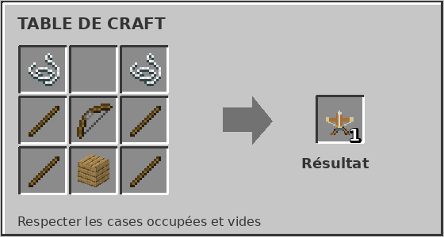

**Résultat : 1 baliste légère.** C'est la variante la plus accessible pour couvrir une entrée ou commencer une ligne de défense. L'arc est consommé par la fabrication.

### Baliste moyenne

**Ingrédients :** 2 ficelles, 1 lingot de fer, 3 planches, 1 arbalète et 2 bâtons. **Fabrication avec motif.**

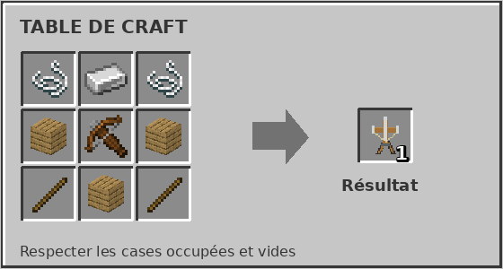

**Résultat : 1 baliste moyenne.** Elle n'utilise pas la légère comme ingrédient : elle se fabrique directement. Prévois une autre défense pour couvrir son rechargement de quatre secondes.

### Baliste lourde

**Ingrédients :** 2 ficelles, 3 lingots de fer, 3 bûches et 1 arbalète. **Fabrication avec motif.**

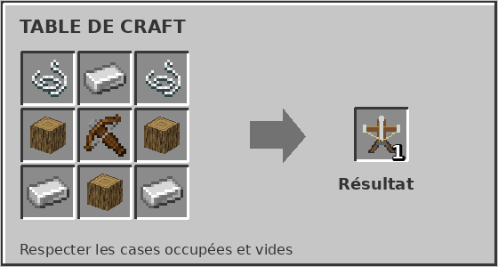

**Résultat : 1 baliste lourde.** Prépare une surface de 2 × 2 blocs et suffisamment de dégagement. Une installation trop serrée peut bloquer la pose ou la ligne de tir.

### Amorces de carreau

**Ingrédients :** 1 pépite de fer, 1 bâton et 1 plume. **Fabrication sans forme.**

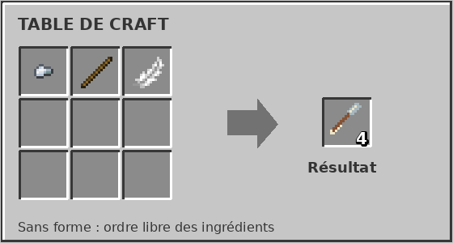

**Résultat : 4 amorces de carreau.** Les amorces sont directement utilisables comme munitions : il n'y a pas un second craft obligatoire pour les transformer en carreaux.

### Charger et ravitailler une baliste

Pose la baliste avec son objet, puis interagis avec elle en tenant des **flèches ordinaires ou des amorces**. Chaque objet chargé ajoute un tir, jusqu'à **64 tirs en réserve**. La baliste prend les munitions dans la pile tenue en main, dans la limite de la place disponible.

Sans table d'archerie reconnue, chaque tir consomme une unité de cette réserve. Avec une table reconnue sous son emprise ou contre un côté, elle tire **sans consommer de munitions**, y compris avec une réserve vide. La table vanilla donne les tirs ordinaires ; les trois tables spéciales changent le type de carreau.

Une table éloignée de quelques blocs n'est pas un ravitaillement valide. Pour une installation simple, place la table **directement à côté de la base**, sans laisser de bloc vide entre les deux. Dégage aussi la trajectoire : la présence de munitions n'autorise pas un tir à travers un mur.

### Propriété, récupération et projectiles

La baliste posée est liée à son propriétaire. Les autres joueurs ne peuvent normalement pas la gérer à sa place ; le mode créatif dispose d'exceptions. Pour récupérer ta baliste, interagis avec elle **accroupi et la main vide**. Elle rend l'objet de baliste et sa réserve sous forme de **flèches ordinaires**, même lorsque des amorces avaient servi au chargement.

Un carreau peut atteindre jusqu'à **trois cibles distinctes**. Ne confonds pas cette capacité à traverser plusieurs créatures avec le contournement de l'armure : ce dernier est une propriété particulière du tir d'obsidienne.

## 3. Les tables d'archerie et les tirs spéciaux

Toutes ces tables servent au ravitaillement lorsqu'elles sont correctement placées près d'une baliste. Elles ne demandent pas de fabriquer des munitions élémentaires séparées. Une baliste utilise le type correspondant à la table détectée : installer plusieurs tables spéciales ne fusionne pas leurs effets. Pour choisir clairement ton tir, utilise une seule table spéciale à portée de ravitaillement.

### Table d'archerie en obsidienne

**Ingrédients :** 1 table d'archerie vanilla et 4 blocs d'obsidienne. **Fabrication sans forme.**

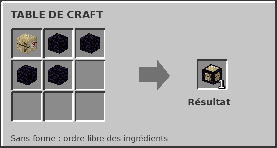

**Résultat : 1 table d'archerie en obsidienne.** Elle sélectionne les carreaux perce-armure. Leur type de dégâts contourne l'armure et le bouclier ; un impact réussi applique aussi **Fissure pendant 5 secondes**.

**Fissure réduit l'attribut d'armure de 30 %.** Ce n'est pas une réduction de 30 % de la vie maximale. Le malus peut également rendre la cible plus vulnérable à d'autres attaques pendant sa durée.

### Table d'archerie infernale

**Ingrédients :** 1 table d'archerie, 2 poudres de Blaze et 2 briques du Nether. Les briques demandées sont les **objets**, pas les blocs de briques. **Fabrication sans forme.**

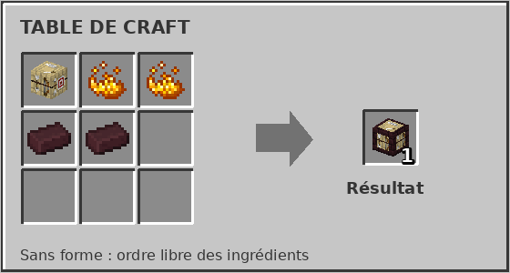

**Résultat : 1 table d'archerie infernale.** Le carreau peut enflammer une cible non immunisée pendant **6 secondes**. Son impact crée une **zone incendiaire d'environ 3 × 3 blocs**, active pendant **4 secondes**.

La zone applique périodiquement des dégâts de feu et entretient l'embrasement des créatures exposées. Lorsque les règles du monde autorisent les dégâts des créatures sur le terrain, du feu peut aussi être placé. Évite donc de l'installer au milieu d'un passage de villageois ou contre des constructions inflammables.

### Table d'archerie des profondeurs

**Ingrédients :** 1 table d'archerie et 4 éclats d'écho. **Fabrication sans forme.**

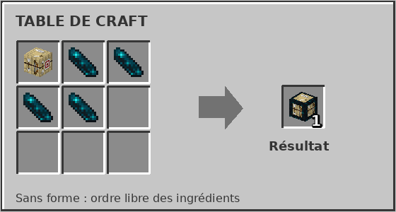

**Résultat : 1 table d'archerie des profondeurs.** Le tir déclenche un choc autour de l'impact, avec une portée horizontale de **4 blocs** et une recherche sur environ **2 blocs au-dessus et au-dessous**.

Les créatures affectées subissent un recul, perdent leur sprint et reçoivent **Choc acoustique pendant 1 seconde**. Cet effet réduit temporairement leur vitesse de déplacement de 100 %. Il sert donc surtout à interrompre et contenir une avancée ; il ne dure pas plusieurs secondes à chaque impact.

## 4. Les pieux : ralentir les ennemis sans piéger ses alliés

Les pieux agissent au contact. **Ils ne distinguent pas automatiquement un ennemi d'un villageois, d'un animal ou d'un joueur en survie.** Prévois un accès sûr pour les habitants et pour toi. Les joueurs en créatif et les spectateurs sont exclus du déclenchement normal.

### Pieux en bois

**Ingrédients :** 3 bâtons et 3 dalles de pierre. **Fabrication avec motif : la ligne centrale doit rester vide.**

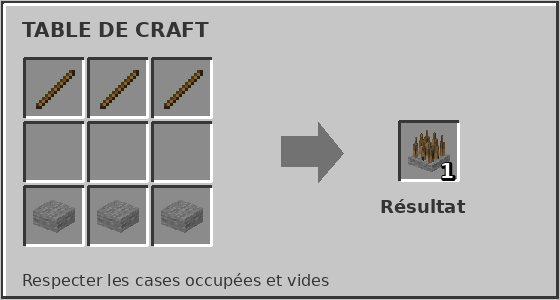

**Résultat : 1 bloc de pieux en bois.** Le contact inflige **4 points de dégâts de base** et applique **Lenteur I pendant 3 secondes**.

### Pieux renforcés en fer

**Ingrédients :** 1 bloc de pieux en bois et 3 lingots de fer. **Fabrication sans forme.**

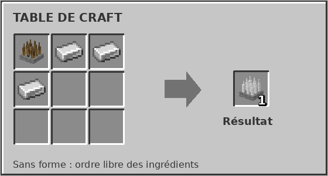

**Résultat : 1 bloc de pieux renforcés en fer.** Il inflige **10 points de dégâts de base**, applique **Lenteur II pendant 4 secondes** et interdit le saut pendant **4 secondes**.

Une même créature ne reprend pas les dégâts des pieux à chaque tick : le mécanisme espace ces dégâts d'environ **une seconde**. Rester sur le piège continue néanmoins à renouveler les effets de contrôle.

### Les placer et les dissimuler

Les couches de neige, les tapis de laine, les feuilles et les tapis de mousse font partie des couvertures reconnues par le mécanisme de camouflage. Cela ne transforme pas n'importe quel bloc plein posé au-dessus en piège fonctionnel. Vérifie que la créature marche réellement sur la couverture du piège.

Une bande de pieux devant les balistes permet de retenir des cibles dans leur portée. Laisse en parallèle un couloir sans pieux : dissimuler les pièges ne les rend pas inoffensifs pour les alliés.

## 5. Réparer les balistes endommagées trouvées dans le monde

Les épaves sont des blocs récupérables, notamment liés aux villages abandonnés. **Une épave ne tire pas.** Récupère-la, effectue sa réparation à la table de craft, puis pose la baliste obtenue comme une baliste neuve.

### Réparer une baliste légère

**Ingrédients :** 1 baliste légère endommagée, 2 bâtons et 2 ficelles. **Sans forme.**

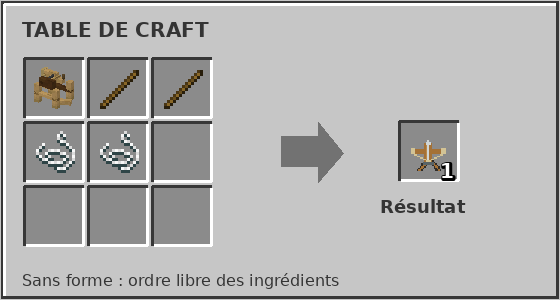

**Résultat : 1 baliste légère utilisable**, à installer puis à ravitailler.

### Réparer une baliste moyenne

**Ingrédients :** 1 baliste moyenne endommagée, 2 lingots de fer et 1 bûche. **Sans forme.**

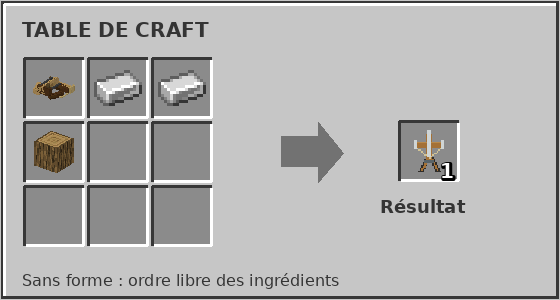

**Résultat : 1 baliste moyenne utilisable.** Une planche ne remplace pas la bûche demandée.

### Réparer une baliste lourde

**Ingrédients :** 1 baliste lourde endommagée, 3 lingots de fer et 1 arbalète. **Sans forme.**

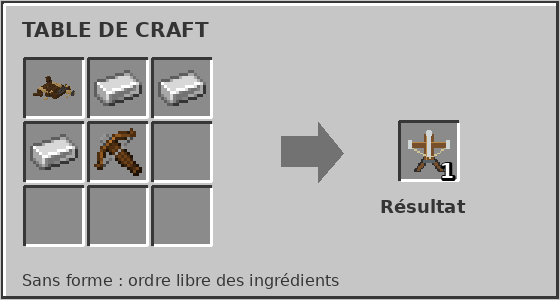

**Résultat : 1 baliste lourde utilisable.** La recette restitue bien l'objet permettant de poser une défense, pas un autre bloc d'épave.

## 6. Le chasseur de dragons : poste de travail, ressources et carte

Le chasseur de dragons est un marchand particulier du mod. On peut le rencontrer dans les villages équipés par la génération du mod. **Les échanges se font en interagissant avec le chasseur**, et non en ouvrant une interface de craft sur sa table.

### Fabriquer sa table de chasse draconique

**Ingrédients :** 2 planches, 1 carte vierge, 4 lingots d'or et 2 blocs de pierre lisse. **Fabrication avec motif.**

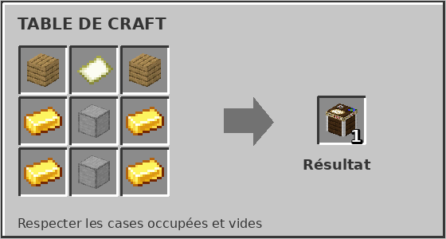

**Résultat : 1 table de chasse draconique.** Elle sert de poste de travail au chasseur. Poser cette table ne transforme pas à lui seul un villageois ordinaire en chasseur et ne fait pas automatiquement apparaître un marchand.

Un chasseur recherche un poste disponible à proximité. Garde sa table accessible : le réapprovisionnement demande qu'il soit à **3 blocs au plus**, qu'il puisse voir la table et qu'il ne soit pas occupé à combattre ou commercer. Après un réapprovisionnement réussi, le suivant est prévu **24 000 ticks plus tard**, soit environ **20 minutes de simulation**. Bloquer le chasseur derrière un mur peut donc empêcher le renouvellement des offres.

### Offres de base

| Ce que tu donnes | Ce que tu reçois | Nombre d'échanges avant épuisement de cette offre |
|---|---|---:|
| 2 écailles de dragon | 5 émeraudes | 16 |
| 1 cœur de dragon | 24 émeraudes | 4 |
| 10 émeraudes | 2 écailles de dragon | 16 |
| 32 émeraudes | 1 cœur de dragon | 4 |
| 8 émeraudes | 1 sifflet draconique | 4 |
| 2 émeraudes | 8 amorces de carreau | 16 |
| 16 émeraudes et 1 boussole | 1 carte d'antre de dragon, lorsque cette offre est disponible | 4 |

Ce sont les prix et stocks de base. Consulte toujours la fenêtre du marchand pour l'offre actuellement disponible.

### Utiliser une carte d'antre

La carte est une **carte personnalisée avec un repère**, pas un nouvel objet à fabriquer à la table de craft. Son offre dépend de la présence d'un antre connu du monde : l'absence de cette offre ne signifie pas qu'il faut fabriquer une autre table ou apporter davantage de cœurs.

Une carte donne une destination d'exploration. Prépare ton équipement avant le départ : les antres peuvent contenir un dragon, du butin et des œufs.

## 7. Les dragons : obtenir un œuf et l'élever jusqu'à l'âge adulte

### Les trois couleurs et les bons œufs

| Œuf à incuber | Apparence | Dragon obtenu |
|---|---|---|
| Œuf de dragon rouge | 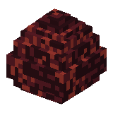 | Dragon rouge |
| Œuf de dragon bleu | 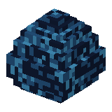 | Dragon bleu |
| Œuf de dragon vert | 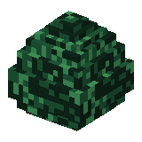 | Dragon vert |

Les œufs à incuber se récupèrent dans le monde, notamment dans les antres. Un dragon adulte peut également laisser tomber un œuf de sa couleur à sa mort. **Aucun craft ne fabrique ces œufs dans cette version.**

Ne les confonds pas avec les œufs d'apparition de dragons du mode créatif, qui font apparaître une entité directement, ni avec l'œuf vanilla de l'Ender Dragon. Le mod possède aussi un œuf d'apparition du chasseur ; ces quatre objets d'apparition n'ont pas de recette de survie.

Les couleurs distinguent les dragons et les thèmes de leurs antres. **Dans cette version, les attaques de souffle et de projectile examinées conservent un fonctionnement incendiaire commun** : le dragon bleu ne demande donc pas une incubation dans la glace, et la couleur verte ne suffit pas à déduire un souffle empoisonné.

### Construire une installation d'incubation

Pose l'œuf dans un endroit dégagé et maintiens au moins un bloc de **magma ou de lave à 3 blocs au plus**. Cette distance est mesurée dans l'espace : une source placée très en diagonale peut être trop éloignée.

Une disposition pratique consiste à installer, du bas vers le haut : **magma → bloc de sol plein → œuf**. Le magma est alors à deux blocs de l'œuf, sans être directement dans le passage. Ce montage est un exemple d'installation, pas une structure obligatoire.

Garde de l'air au-dessus et autour du point de naissance. Le bébé doit pouvoir apparaître sans collision. Les torches, les lanternes, les fours, les feux de camp et la chaleur d'un biome ne remplacent pas la présence de magma ou de lave.

### Combien de temps prend l'éclosion ?

L'incubation demande **48 000 ticks, soit environ 40 minutes** de simulation active avec la chaleur requise. Les trois couleurs suivent cette même règle.

| Temps d'incubation accumulé | Ce que montre l'œuf |
|---|---|
| Avant 13 min 20 s | Premier état |
| À partir de 13 min 20 s | Première progression de fissure |
| À partir de 26 min 40 s | Dernier état de fissure |
| À partir de 40 min | Éclosion si les conditions et l'espace restent valides |

Un œuf très fissuré n'a donc pas forcément terminé ses quarante minutes. La disparition de la chaleur **suspend** le compteur sans l'effacer. La zone doit rester simulée et l'apparition des créatures doit être autorisée. Dormir pour changer l'heure ne remplace pas les ticks nécessaires.

Sauvegarder puis recharger conserve la progression de l'œuf posé. **Le casser et le reposer ne conserve pas cette progression** : évite de déplacer ton installation en cours d'incubation.

### Devenir son propriétaire à la naissance

L'apprivoisement se décide au moment de l'éclosion. Le jeu cherche d'abord un **dragon adulte sauvage vivant à proximité, dans un rayon de 16 blocs**. S'il en trouve un, le bébé peut se rattacher à cet adulte comme parent, avant toute recherche d'un joueur.

Sinon, le **joueur vivant, non spectateur, le plus proche à moins de 8 blocs du point de naissance** devient le propriétaire. Le joueur qui a posé l'œuf n'a pas de réservation spéciale.

Pour réussir, éloigne les adultes sauvages et reste près de l'œuf pendant la fin de l'incubation. En multijoueur, assure-toi d'être le joueur éligible le plus proche. La nourriture n'est pas une procédure alternative permettant d'apprivoiser un adulte sauvage après coup.

### Nourrir son dragon

Tiens un aliment accepté et interagis avec **ton dragon**. Les aliments acceptés sont :

| Famille | Cru | Cuit |
|---|---|---|
| Bœuf | Bœuf cru | Steak |
| Porc | Côtelette de porc crue | Côtelette de porc cuite |
| Poulet | Poulet cru | Poulet cuit |
| Mouton | Mouton cru | Mouton cuit |
| Lapin | Lapin cru | Lapin cuit |

Les dix aliments ont le même effet de croissance. Le poisson, la chair putréfiée, les os, les pommes et le pain ne font pas partie de cette liste.

Un morceau accepté ajoute **5 minutes de réserve alimentaire** à un jeune dragon et soigne jusqu'à **6 points de vie, soit 3 cœurs**. La réserve est plafonnée à **40 minutes**. Il faut donner l'aliment en main : le placer dans le coffre de transport ou le jeter par terre ne crédite pas ce compteur de croissance.

### Bébé, adolescent puis adulte

| Stade | Santé maximale de base | Temps nécessaire pour passer au suivant | Nourriture nécessaire depuis une réserve vide |
|---|---:|---:|---:|
| Bébé | 24 PV, soit 12 cœurs | 40 minutes nourries | 8 morceaux |
| Adolescent | 60 PV, soit 30 cœurs | 40 minutes nourries supplémentaires | 8 morceaux supplémentaires |
| Adulte | 120 PV, soit 60 cœurs | Croissance terminée | La nourriture sert aux soins |

Prévois **environ deux heures depuis la pose de l'œuf** : quarante minutes d'incubation, quarante minutes de bébé à adolescent, puis quarante minutes d'adolescent à adulte. Il faut au minimum **16 morceaux pour les deux étapes de croissance**, hors nourriture gaspillée au plafond et repas supplémentaires destinés aux soins.

La nourriture ne fait pas sauter le temps. Le dragon dépense sa réserve au fil de sa croissance. À réserve vide, il **arrête de grandir**, puis reprend après nourrissage. Ce mécanisme ne lui enlève pas de santé simplement parce que sa réserve est vide.

Le changement de stade vérifie également la place : environ **1,8 × 1,8 × 1,8 bloc** pour devenir adolescent, puis **3 × 3 × 3 blocs** pour devenir adulte. Construis un enclos plus grand que ce minimum, pour laisser de la place aux ailes et aux déplacements. Si la croissance est terminée mais que le volume est bloqué, le changement attend.

Un jeune en pleine santé peut refuser un repas lorsque sa réserve est presque pleine. Un adulte en pleine santé refuse normalement la nourriture, puisqu'il ne grandit plus. Les particules de cœur du repas ne signifient pas qu'un système de reproduction entre deux adultes a été déclenché.

### Ce que laisse un dragon à sa mort

| Stade | Écailles | Cœurs de dragon | Œuf à incuber |
|---|---:|---:|---|
| Bébé | 1 | Aucun | Aucun |
| Adolescent | 1 à 3 | 1 | Aucun |
| Adulte | 2 à 4 | 1 | 1 de sa couleur |

Ces ressources proviennent du mécanisme de butin du dragon, lorsque le butin des créatures est autorisé. Les objets qu'il transporte peuvent s'ajouter à ces ressources. Les écailles et les cœurs peuvent aussi s'acheter au chasseur : il n'est pas nécessaire de sacrifier son propre dragon pour les obtenir.

## 8. Fabriquer et équiper sa monture

**Le dragon doit être adulte et t'appartenir.** L'interaction avec la selle ou l'armure permet d'équiper un emplacement encore libre. Pour gérer un équipement déjà installé, ouvre son inventaire plutôt que de supposer qu'un clic remplacera automatiquement l'ancien objet.

### Selle draconique

**Ingrédients :** 3 cuirs, 2 lingots de fer et 2 écailles de dragon. **Avec motif.**

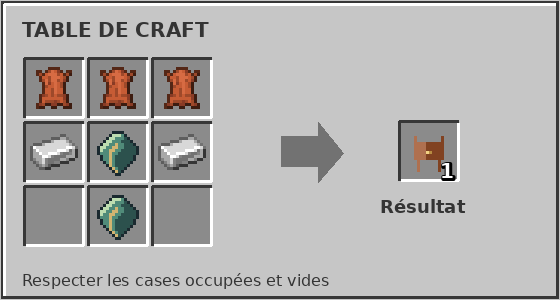

**Résultat : 1 selle draconique.** Équipe-la sur ton dragon adulte, puis interagis normalement **avec la main vide** pour monter. Une selle vanilla ne remplace pas cette selle particulière.

### Selle draconique de transport

**Ingrédients :** 1 selle draconique et 4 coffres. **Sans forme.**

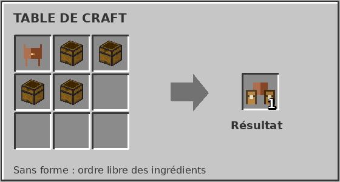

**Résultat : 1 selle draconique de transport.** Elle permet toujours de monter le dragon et donne accès à **deux compartiments de 54 emplacements**, soit **108 emplacements** au total. Les quatre coffres du craft correspondent donc à deux doubles coffres de transport.

Ouvre l'équipement de ton dragon pour accéder au chargement. Par précaution, vide les compartiments avant de changer de selle. La nourriture rangée dans ces compartiments ne nourrit pas automatiquement le dragon.

### Bâton draconique

**Ingrédients :** 1 lingot d'or, 2 écailles, 1 émeraude et 1 bâton. **Avec motif.**

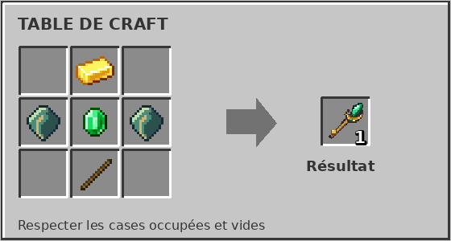

**Résultat : 1 bâton draconique.** Il sert à sélectionner et commander un dragon déjà possédé. Il ne transforme pas un dragon sauvage en monture.

### Armure de dragon en fer

**Ingrédients :** 6 lingots de fer et 1 écaille. **Avec motif.**

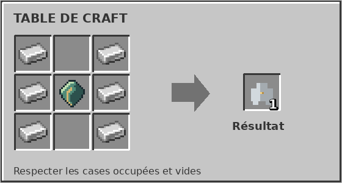

**Résultat : 1 armure de dragon en fer**, donnant **8 points d'armure de base** au dragon équipé.

### Armure de dragon en or

**Ingrédients :** 6 lingots d'or et 1 écaille. **Avec motif.**

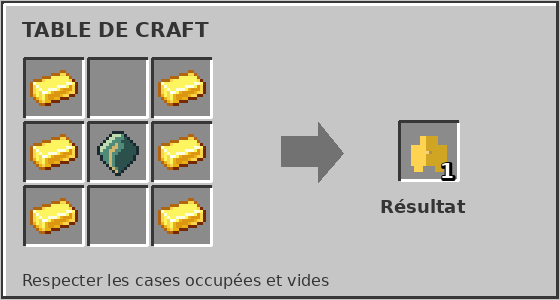

**Résultat : 1 armure de dragon en or**, donnant **10 points d'armure de base**. Dans ce mod, cette variante protège donc davantage le dragon que celle en fer.

### Armure de dragon en diamant

**Ingrédients :** 6 diamants et 1 écaille. **Avec motif.**

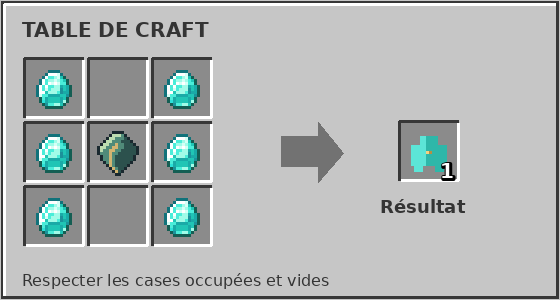

**Résultat : 1 armure de dragon en diamant**, donnant **14 points d'armure de base**. Elle sert également de base à la version netherite.

### Armure de dragon en netherite

**Ingrédients :** 1 armure de dragon en diamant, 1 lingot de netherite et 1 écaille. **Sans forme, à la table de craft.**

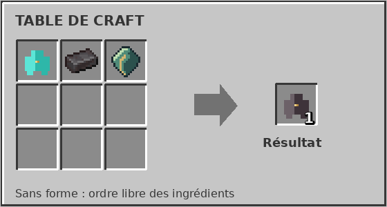

**Résultat : 1 armure de dragon en netherite**, donnant **18 points d'armure de base**. Cette recette ne demande **ni table de forge ni modèle d'amélioration**.

Ces quatre armures sont destinées **au dragon**, pas au joueur. Pour renforcer l'armure que tu portes, utilise les renforts en écailles décrits plus bas.

## 9. Donner des ordres, monter et combattre

### Sélectionner son dragon et ouvrir les ordres

Le **bâton draconique** et le **sifflet draconique** sont des objets de commandement. Le sifflet s'achète au chasseur contre **8 émeraudes au prix de base** ; il n'a pas de recette de fabrication dans cette version.

Une interaction directe avec ton dragon et un objet de commandement le sélectionne et fait défiler son ordre. L'utilisation de l'objet dans l'air permet d'ouvrir les commandes du dragon sélectionné. Le sifflet peut rechercher une monture possédée à proximité ; il ne s'agit pas d'un appel traversant tous les mondes et tous les chunks déchargés.

| Ordre ou commande | Utilisation |
|---|---|
| Suivre | Demander au dragon de suivre son propriétaire. |
| Assis / Garde | Le maintenir en position plutôt que le laisser suivre librement. |
| Poste au sol | Fixer un poste validé au sol, dans un espace accessible. |
| Poste en l'air | Fixer une position de garde aérienne. |
| Patrouille | Définir une zone autour d'un point d'ancrage. |
| Promenade | Autoriser les déplacements du comportement de promenade. |
| Rappeler | Repasser en suivi et mettre brièvement le dragon en évidence. Ce n'est pas une téléportation. |

Pour recevoir les ordres, le dragon doit être **vivant, chargé, à toi et non monté**. Le contrôle de distance du dragon sélectionné est limité à **256 blocs** ; la sélection initiale et certaines interactions utilisent une portée plus courte. Les destinations de poste sont limitées à **64 blocs du joueur** et refusées si l'emplacement n'est pas valide.

### Définir une patrouille

Le rayon de patrouille est réglable entre **16 et 64 blocs**. Un bloc d'ancrage reconnu permet de matérialiser le point de patrouille : utilise l'objet de commandement sur ce bloc après avoir sélectionné ton dragon.

Les ancres fournies comprennent notamment la **magnétite**, les blocs de fer, d'or, de cuivre, de diamant, d'émeraude et de netherite, ainsi que plusieurs blocs de minerais. Utiliser un bloc ordinaire quelconque ne garantit pas l'ancrage. Prévois un environnement dégagé pour que le dragon puisse circuler autour de son poste.

### Ouvrir l'inventaire et monter

Sur un adulte possédé, l'interaction **accroupie** ouvre l'équipement lorsque les conditions sont réunies. Ne tiens pas un objet de commandement si tu cherches simplement à ouvrir ce menu : cet objet possède sa propre interaction.

La touche **B** ouvre par défaut l'inventaire du dragon dans les situations prévues par les contrôles. Pour monter, utilise une interaction normale, main vide, sur ton adulte déjà sellé et sans autre passager.

### Contrôles de vol et attaques

Utilise les commandes habituelles de déplacement pour diriger la monture. Le saut permet de monter ; l'inclinaison de la vue intervient dans le déplacement vertical en vol. Prévois un endroit dégagé pour les premiers essais et évite de te désarçonner en altitude.

| Action | Commande par défaut ou repère |
|---|---|
| Ouvrir l'inventaire du dragon | B |
| Souffle | Touche 1, à maintenir |
| Boule de feu | Touche 2 |
| Modifier ces touches | Options → Contrôles → catégorie du dragon |

Les touches se reconfigurent ; vérifie leur affichage sur ton clavier, particulièrement avec une disposition française.

Le souffle utilise une réserve de **100 points**, consommée pendant l'attaque. Une réserve pleine permet environ **5 secondes de souffle continu**. La récupération rend environ **10 points par seconde**, soit dix secondes pour une recharge complète depuis zéro. Après épuisement, il faut récupérer suffisamment de réserve avant de reprendre le souffle ; le seuil de reprise est **40 points**.

La boule de feu possède un délai de **3 secondes** entre les tirs. L'interface indique la réserve de souffle et l'attente du projectile. Le souffle agit à courte distance, jusqu'à environ **12 blocs** dans sa direction : ce n'est pas une attaque à travers les murs de toute une base.

## 10. Renforcer l'armure du joueur avec des écailles

Les renforts sont des **composants à appliquer à ton armure existante**. Ils ne se portent pas seuls et ne sont pas les armures de monture présentées plus haut.

Il faut d'abord fabriquer chaque renfort, puis l'appliquer à la pièce correspondante à la **table de forge**, en laissant l'emplacement du modèle **vide**. L'armure utilisée comme exemple sur les images est en diamant ; ce n'est pas une obligation d'utiliser le diamant.

### Fabriquer les quatre renforts

#### Renfort de casque

**Ingrédients : 5 écailles. Résultat : 1 renfort de casque.** Fabrication avec motif.

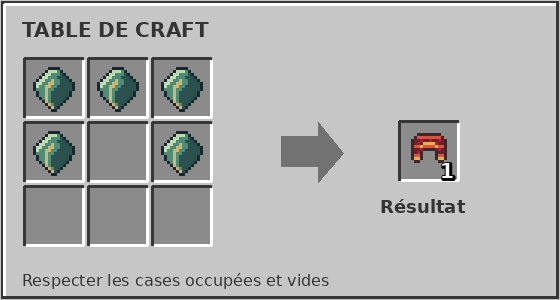

#### Renfort de plastron

**Ingrédients : 8 écailles. Résultat : 1 renfort de plastron.** Fabrication avec motif.

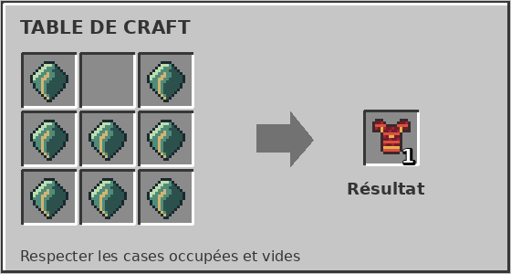

#### Renfort de jambières

**Ingrédients : 7 écailles. Résultat : 1 renfort de jambières.** Fabrication avec motif.

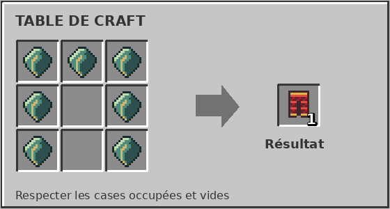

#### Renfort de bottes

**Ingrédients : 4 écailles. Résultat : 1 renfort de bottes.** Fabrication avec motif.

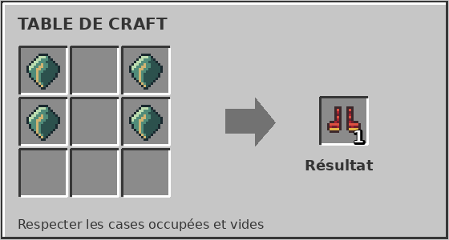

Il faut donc **24 écailles** pour fabriquer les quatre renforts d'un ensemble complet.

### Appliquer les renforts à la table de forge

Dans les trois emplacements d'entrée, place **rien dans le modèle**, l'armure au centre et son renfort à droite. Récupère l'armure améliorée dans la sortie. Le renfort est consommé ; la pièce conserve son identité, ses enchantements et son usure.

#### Casque amélioré

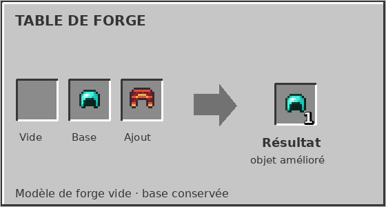

**Résultat : 1 casque renforcé d'écailles.** Il compte comme la pièce de tête de l'ensemble.

#### Plastron amélioré

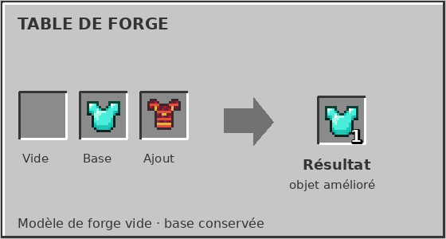

**Résultat : 1 plastron renforcé d'écailles.** Il compte comme la pièce de torse.

#### Jambières améliorées

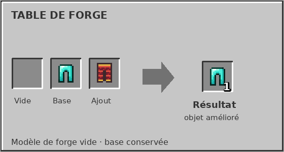

**Résultat : 1 paire de jambières renforcées d'écailles.** Elle compte comme la pièce de jambes.

#### Bottes améliorées

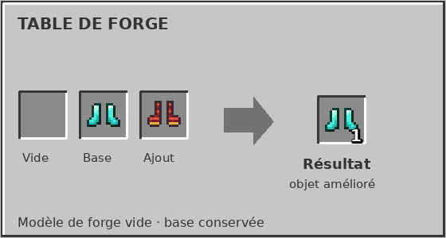

**Résultat : 1 paire de bottes renforcées d'écailles.** Elle complète l'ensemble.

### Quel effet reçoit le joueur ?

**Les quatre pièces renforcées doivent être portées simultanément.** L'ensemble complet donne la protection prévue contre les dégâts de feu, éteint le porteur et lui permet de **nager dans la lave** avec le comportement ajouté par le mod.

Porter un casque renforcé seul ne donne pas ces effets d'ensemble. Les quatre pièces peuvent être de matériaux différents, du moment qu'elles sont compatibles et toutes renforcées. Une pièce déjà renforcée ne peut pas recevoir une seconde fois le même renfort.

L'apparence de l'objet peut rester celle de l'armure d'origine ; la mention de renforcement permet de reconnaître l'amélioration. Cette protection ne rend pas invulnérable aux chutes, aux coups ou aux projectiles.

## 11. Le cœur de dragon : améliorer une arme, un outil ou un bouclier

Le cœur se récupère notamment sur les dragons adolescents et adultes, ou s'achète au chasseur. **Il s'utilise à la table de forge, pas à l'enclume.** Il n'existe pas ici de craft produisant un cœur à partir d'autres ingrédients.

### Comment appliquer le premier cœur ?

Ouvre une table de forge. Laisse la case du modèle vide, place ton équipement compatible dans la case de base et **un cœur** dans la case d'ajout. La sortie est **le même équipement amélioré**, pas une nouvelle arme d'un autre matériau.

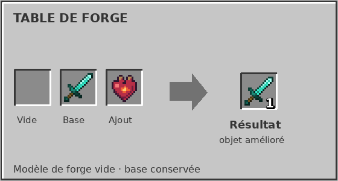

**Exemple illustré : 1 épée en diamant + 1 cœur → 1 épée en diamant renforcée par un cœur de dragon.** Le cœur est consommé lorsque le résultat est pris. L'aspect de l'épée peut rester identique ; ses propriétés et sa description changent.

Les familles compatibles comprennent les **pioches, pelles, houes, haches, épées, lances, la masse, l'arc, l'arbalète et le bouclier**. Les livres enchantés suivent un fonctionnement particulier expliqué plus bas.

### Les bonus du premier cœur

Sur un équipement compatible qui n'a pas encore reçu de cœur, la première application ajoute son amélioration propre.

| Équipement | Effet du premier cœur |
|---|---|
| Équipement possédant une durabilité | **Durabilité maximale multipliée par 3.** Le pourcentage d'usure est conservé. |
| Pioche, pelle, houe et hache | **Vitesse de minage multipliée par 1,5.** Cela ne transforme pas le matériau de l'outil et ne change pas automatiquement les ressources qu'il peut récolter. |
| Épée et lance | **Vitesse d'attaque augmentée de 25 %** lorsqu'elles sont utilisées en main principale ; les coups enflamment la cible pendant **4 secondes**, si elle peut brûler. |
| Hache utilisée en combat | Les coups enflamment également la cible pendant **4 secondes**. Le bonus de vitesse d'attaque des épées et lances ne s'applique pas à la hache. |
| Masse | **+25 % de vitesse d'attaque**, **+4 points d'attribut de dégâts**, embrasement et attaque de zone décrite ci-dessous. |
| Arc et arbalète | Les flèches tirées reçoivent un comportement enflammé pendant leur vol. L'eau interrompt cet effet. |
| Bouclier | Un blocage peut **renvoyer à la créature attaquante le montant des dégâts bloqués** et l'enflammer pendant **4 secondes**. Ce n'est pas un renvoi général de toutes les attaques de joueurs. |

**Ce n'est pas une réparation gratuite.** Par exemple, une arme dont la moitié de la durabilité est déjà usée reste proportionnellement à moitié usée après l'amélioration : son maximum et ses dégâts d'usure sont multipliés ensemble.

La masse produit en plus un effet autour de la cible frappée : des créatures voisines éligibles, dans un rayon de **3 blocs** et visibles, peuvent subir **4 points de dégâts supplémentaires de zone** et brûler. Le filtre épargne notamment l'attaquant, la cible déjà traitée par le coup principal, les alliés et les animaux apprivoisés concernés. Ce n'est pas une explosion détruisant tous les blocs autour du joueur.

Le bouclier doit réellement **bloquer** une attaque pour déclencher son effet. Une attaque impossible à bloquer ne devient pas automatiquement réfléchie grâce au cœur.

### Ajouter d'autres cœurs sur le même équipement

Les applications suivantes ne triplent pas indéfiniment la durabilité et n'empilent pas à nouveau les bonus initiaux. Elles servent à améliorer les **enchantements déjà présents**.

Sur un équipement déjà renforcé, un nouveau cœur sélectionne jusqu'à **deux enchantements différents encore améliorables**, puis augmente chacun de **1 niveau**. Le choix se fait parmi les enchantements existants ; il ne crée pas un nouvel enchantement absent de l'objet. Lorsqu'un seul enchantement peut monter, seul celui-ci est augmenté.

Le plafond traité par cette amélioration est **255 par enchantement**, ce qui peut dépasser les niveaux normalement accessibles. Ce plafond de stockage ne signifie pas que chaque enchantement possède un effet utile différent à chacun de ces niveaux.

**Exemple :** une épée déjà renforcée possède Tranchant V et Solidité III. Si ce sont ses deux seuls enchantements améliorables, le cœur suivant les fait passer à Tranchant VI et Solidité IV. Si elle possède davantage d'enchantements améliorables, les deux choisis ne sont pas nécessairement ceux que tu préfères.

Une arme sans enchantement peut recevoir le **premier** cœur pour les bonus initiaux. Elle ne peut pas recevoir le suivant tant qu'elle n'a aucun enchantement à augmenter. La première infusion ne fait pas également monter les enchantements : l'augmentation relève des applications suivantes.

### Le cas des livres enchantés

Un livre **déjà enchanté** peut être utilisé comme base à la forge avec un cœur. Chaque application augmente **un seul de ses enchantements existants de 1 niveau**, parmi ceux qui sont encore sous le plafond de 255.

Le livre ne reçoit ni durabilité triplée ni vitesse d'attaque. Un livre ordinaire sans enchantement n'est pas cette base spéciale. Si tous les enchantements de la base sont au plafond, la recette n'a plus d'amélioration disponible.

## 12. Antres, trésors et vie des villages

### Explorer les antres

Les antres font partie des ajouts au monde normal. Le choix de leur implantation dépend du terrain et des conditions de génération : il ne suffit pas de marcher une distance fixe pour en trouver un à coup sûr. Les zones froides et enneigées accueillent le thème bleu, les jungles le thème vert, et les autres terrains éligibles le thème rouge.

Les constructions utilisent des ambiances différentes, notamment la glace et la neige pour les bleus, la mousse pour les verts, et des matériaux sombres comme le basalte ou la roche noire pour les rouges. L'antre peut abriter des œufs et du butin ; récupérer un œuf puis l'incuber dans une installation éloignée des adultes sauvages est le parcours vers une monture possédée.

### Trésor des coffres d'antre

Les coffres utilisant les tables d'antre de cette version possèdent le butin de base suivant. Les plages indiquent les quantités tirées par ces tables, pas une promesse que tout coffre quelconque du monde les utilise.

| Butin de base | Quantité prévue par coffre utilisant cette table |
|---|---|
| Lingots de fer | 12 à 24 |
| Diamants | 3 à 8 |
| Émeraudes | 6 à 16 |
| Pièces d'armure sélectionnées parmi les entrées de la table | 1 à 2 tirages : pièces en diamant, ou plastron/jambières en fer |
| Totem d'immortalité | 1 |
| Pommes dorées | 1 à 3 |
| Pommes dorées enchantées | 1 à 2 |

Les tables thématiques ajoutent trois tirages d'objets propres à la couleur : **charges de feu ou crèmes de magma** pour le rouge, **glace compactée ou glace bleue** pour le bleu, **boules de Slime ou yeux d'araignée** pour le vert.

### Dragons sauvages et objets précieux

Les dragons disposent de comportements de patrouille, de retour, de repos et de combat. Les dragons errants peuvent rechercher un emplacement d'antre et interagir avec leur environnement lorsque les règles de modification du terrain le permettent.

Le système de trésor reconnaît notamment les lingots et blocs précieux, les diamants, les émeraudes, les ressources de netherite, certaines pièces d'équipement en diamant ou netherite, les pommes dorées et les totems. Des objets précieux **lâchés au sol** à proximité peuvent être ramassés par le comportement du dragon. Ne confonds pas ces trésors avec les aliments de croissance et évite de jeter ton équipement près d'un dragon en espérant l'équiper ainsi.

Les rencontres de dragons errants font l'objet de tentatives espacées par défaut de **10 à 20 minutes**. Ce n'est pas une apparition garantie à chaque intervalle : la difficulté, les règles d'apparition, les joueurs et le nombre de dragons déjà présents limitent ces rencontres.

### Défense des villages et confiance envers le dragon

La génération du mod peut équiper des villages de défenses et y installer un chasseur. Les épaves offrent une autre voie d'acquisition des balistes, tandis que les tables des chasseurs servent à maintenir leurs échanges.

Un village peut d'abord avoir peur d'un **dragon domestiqué qu'il ne reconnaît pas**. Les villageois proches cherchent alors à s'en éloigner. Lorsqu'un dragon domestiqué, ou son cavalier dans les conditions prévues, élimine un hostile éligible près d'un village enregistré, ce dragon peut être reconnu comme protecteur. Des particules de satisfaction signalent cette reconnaissance.

Cette confiance concerne **le dragon et le village**, pas un bonus de réputation universel pour tous les joueurs. Elle ne dispense pas de protéger les habitants des pieux et des tirs incendiaires.

## 13. Les menaces nocturnes et les invasions zombies

Le mod renforce les dangers de la nuit dans le monde normal, lorsque la difficulté n'est pas Paisible et que les règles d'apparition des créatures et des monstres le permettent. Il peut tenter d'ajouter des zombies, squelettes, araignées et creepers près des joueurs éligibles, sous réserve des contrôles d'apparition et des limites locales.

### Reconnaître une invasion

Une invasion utilise une barre intitulée **« Invasion zombie »**. Le système effectue un tirage au cours des nuits éligibles, avec une chance de **1 sur 4** pour la tentative d'invasion ; cela ne garantit pas qu'un joueur précis en subisse une toutes les quatre nuits.

L'objectif de l'invasion correspond à **200 zombies au total**, répartis en vagues, et non à 200 ennemis apparaissant simultanément. Les vagues sont de **20 ou 40 zombies**, dans la limite du nombre restant. Les apparitions se font progressivement ; après l'élimination d'une vague, la suivante attend environ **10 secondes**.

### Se préparer et terminer l'événement

Couvre plusieurs directions avec les balistes plutôt que de dépendre d'une seule entrée. Les tirs des profondeurs peuvent contenir les groupes, les tirs d'obsidienne aider contre les cibles protégées et les pieux ralentir leur progression. Garde les PNJ en dehors des zones dangereuses.

L'invasion s'achève lorsque son objectif est rempli. Elle est aussi interrompue lorsque ses conditions de maintien ne sont plus réunies, notamment au retour du jour, si le joueur suivi n'est plus disponible dans le monde ou s'il s'éloigne trop du point de départ. Le contrôle de distance utilise **128 blocs** autour de ce point. Une interruption nettoie les créatures encore suivies par l'événement ; elle ne constitue pas une victoire avec une récompense spéciale garantie.

## 14. Régler les rencontres et les dégâts dans son monde

Ces commandes sont destinées aux joueurs ayant les permissions d'administration du monde. Elles modifient les réglages enregistrés dans la sauvegarde ; ce ne sont pas des recettes ni des objets à fabriquer.

| Commande | Fonction |
|---|---|
| `/dragonsettings` | Afficher les réglages actuels. |
| `/dragonsettings frequency 10 20` | Régler les bornes des tentatives de rencontre à 10 et 20 minutes. Les valeurs admises vont de 2 à 120 minutes. |
| `/dragonsettings damage 1` | Utiliser le multiplicateur de dégâts draconiques normal. La plage admise est 0,25 à 3 ; les commandes utilisent le point décimal, par exemple `0.5`. |
| `/dragonsettings terrain false` | Désactiver le réglage du mod autorisant les effets draconiques concernés sur le terrain. |
| `/dragonsettings terrain true` | Réactiver ce réglage, sous réserve des autres règles du monde. |

Par défaut, les bornes de rencontre sont **10–20 minutes**, le multiplicateur est **1** et le réglage de terrain est activé. L'espacement des rencontres n'est pas un réglage de fréquence de tous les antres : rencontres dynamiques et structures du monde sont deux mécanismes différents.

## 15. Installation

Le fichier documenté est **`ballista-fabric-0.27.1+mc26.2.jar`**. Il demande **Minecraft Java 26.2**, **Fabric Loader 0.19.3 ou plus récent**, **Fabric API** et **Java 25 ou plus récent**. Cette fiche ne déduit aucune compatibilité avec une autre version de Minecraft.

Installe les dépendances correspondant à Minecraft 26.2, place le JAR dans le dossier `mods` de l'instance, puis vérifie que **Baliste** apparaît parmi les mods chargés. Sauvegarde un monde existant avant d'y ajouter le mod. Sur un serveur moddé, veille à utiliser les versions correspondantes du mod et de ses dépendances sur les installations concernées.

<strong>Version de référence et sources de cette documentation</strong>

Le guide est établi à partir du JAR fourni par l'auteur, d'empreinte SHA-256 :

`e85ac8a4a68c773b2ab5b81c1dc7eedad2b6eee91028ebd29d8c68ab1c245b55`

| Partie du guide | Sources vérifiées dans le JAR |
|---|---|
| Ingrédients, dispositions et résultats | Les 29 recettes de `data/ballista/recipe/` ; les classes de recettes spéciales pour la forge. |
| Balistes et ravitaillement | `BallistaVariant`, `BallistaItem`, `BallistaMount`, `BallistaEntity`, `SpecialFletchingTables`. |
| Carreaux et effets | `BallistaBolt`, `BallistaFlameZone`, `BallistaEffects` et les types de dégâts. |
| Pieux et camouflage | `SpikeTraps`, `SpikeBlock` et les mixins associés. |
| Chasseur, échanges et confiance | `DragonHunter`, `DragonHunterTable`, `DragonVillages`, `DragonVillageData`. |
| Incubation, propriété et croissance | `DragonLifeRules`, `DragonEggBlockEntity`, `HatchingDragonEgg`, `SiegeDragon` et les aliments de `dragon_meat`. |
| Butin des dragons | `SiegeDragon.dropCustomDeathLoot`, en complément des tables de butin des entités. |
| Équipement, inventaire et ordres | `DragonEquipment`, `DragonEquipmentMenu`, `DragonOrders`, `DragonCommandRequest`, `DragonControls` et `SiegeDragon`. |
| Renforts en écailles | `DragonScaleRecipe`, `DragonScaleArmor` et `DragonLavaSwimmingMixin`. |
| Cœur : première infusion et applications suivantes | `DragonHeartRecipe`, `DragonHeartUpgrades`, les mixins de coup, de flèche et de bouclier, ainsi que les familles d'équipement acceptées. |
| Antres, thèmes et trésors | `DragonLairs`, `DragonLairLayout`, `DragonLairIndex`, `DragonRoamGoal`, `upgrade.LairThemes` et les quatre tables de coffres d'antre. |
| Rencontres, nuits et réglages | `DragonEncounters`, `NightThreats`, `HostileAwareness`, `DragonSettings`. |
| Dépendances | `fabric.mod.json`. |

Les 29 visuels de recette sont présents dans `site/generated/crafts/` : leurs ingrédients, leurs sorties et leurs quantités ont été comparés aux recettes du JAR. Les icônes d'œufs et du cœur viennent de `site/generated/icons/`.

Les ressources du mod et de Minecraft conservent leurs droits respectifs. Le JAR du mod et le client Minecraft complets ne sont pas redistribués dans ce README. Les comportements décrits sont ceux de cette version, sans promesse de validation en jeu de chaque scénario.

